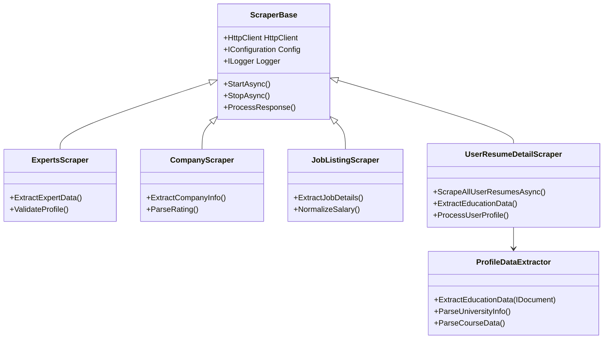
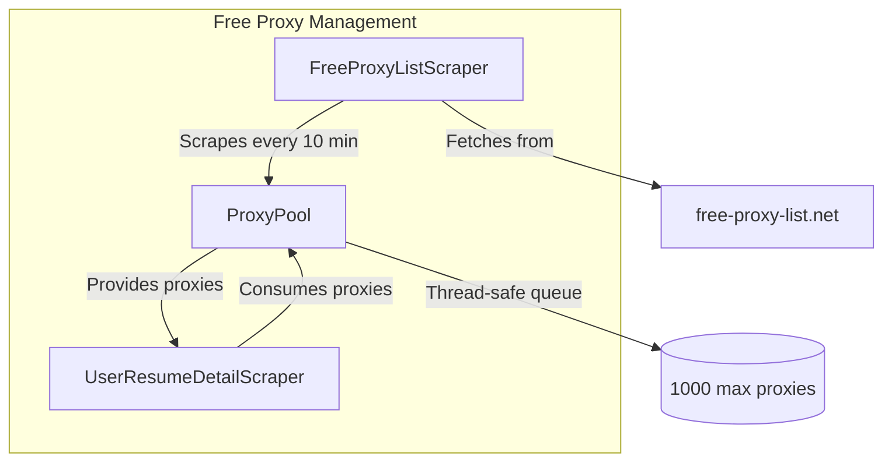
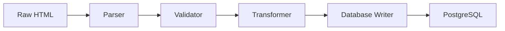
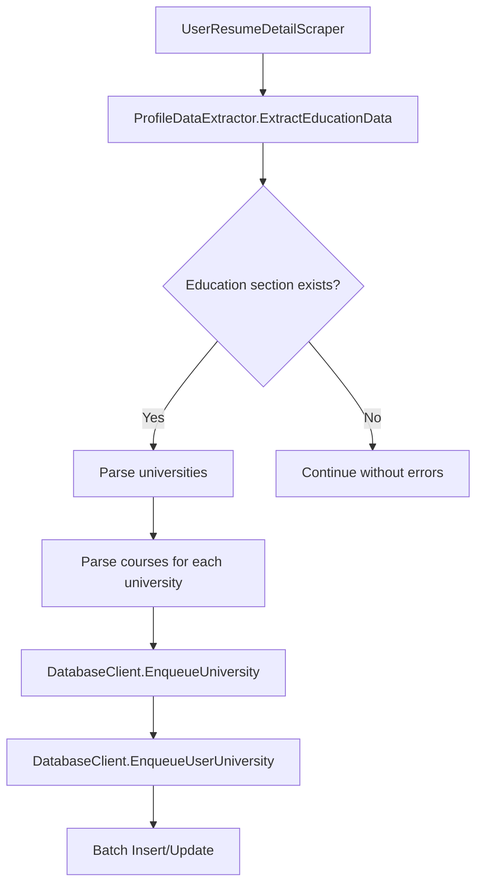
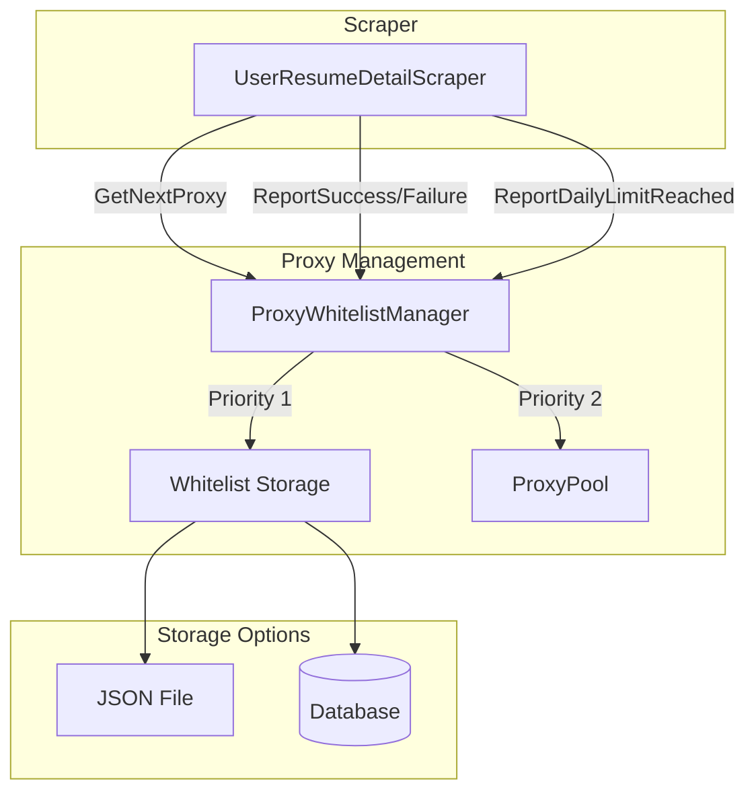

# System Architecture

## Overview

JobBoardScraper is built on a modular, scalable architecture designed for high-performance web scraping with robust error handling and proxy management.

## Core Components

### 1. Scraper Layer



### 2. Proxy Management System

```
┌───────────────────────────────────────────────────────┐
│                    Proxy Coordinator                   │
├───────────────────────────────────────────────────────┤
│ - CurrentProxyIndex                                  │
│ - ProxyList                                          │
│ - HealthMonitor                                      │
│ - RotationStrategy                                   │
│                                                       │
│ + GetNextProxy()                                     │
│ + MarkProxyFailed()                                  │
│ + RotateProxy()                                      │
│ + GetProxyHealthStatus()                             │
└───────────────────────────────────────────────────────┘
```

### 3. Free Proxy Scraper Architecture



### 4. Data Pipeline



### 5. University Education Data Flow



### 6. Proxy Whitelist Management



### 7. Progress Tracking System

The system uses a custom thread-safe progress tracking mechanism to report scraping execution statistics in multi-threaded environments. It ensures accurate, atomic updates of items processed and displays real-time progress.

For more details, see [Progress Tracking System](PROGRESS_TRACKING.md).

## Technical Stack

### Backend
- **.NET 9.0** - Core framework
- **C# 12** - Programming language
- **ASP.NET Core** - Web components
- **Entity Framework Core** - ORM

### Database
- **PostgreSQL 12+** - Primary data store
- **Npgsql** - .NET PostgreSQL driver
- **Dapper** - Micro-ORM for performance

### Infrastructure
- **Polly** - Resilience and retry policies
- **Serilog** - Structured logging
- **Quartz.NET** - Job scheduling
- **AutoMapper** - Object mapping

## Deployment Architecture

### Single Node Deployment

```
┌───────────────────────────────────────────────────────┐
│                    Single Server                     │
├───────────────────────────────────────────────────────┤
│                                                       │
│  ┌─────────────┐    ┌─────────────┐    ┌─────────────┐  │
│  │  Scraper    │    │  Scraper    │    │  Scraper    │  │
│  │  Process 1  │    │  Process 2  │    │  Process N  │  │
│  └─────────────┘    └─────────────┘    └─────────────┘  │
│          │               │               │             │
│          ▼               ▼               ▼             │
│  ┌─────────────────────────────────────────────────┐  │
│  │               Proxy Manager                   │  │
│  └─────────────────────────────────────────────────┘  │
│                  │                              │  │
│                  ▼                              ▼  │
│  ┌─────────────────────┐            ┌─────────────────┐  │
│  │   PostgreSQL       │            │   Monitoring    │  │
│  │   Database         │            │   Dashboard      │  │
│  └─────────────────────┘            └─────────────────┘  │
│                                                       │
└───────────────────────────────────────────────────────┘
```

### Distributed Deployment

```
┌─────────────┐    ┌─────────────┐    ┌─────────────┐
│  Worker 1   │    │  Worker 2   │    │  Worker N   │
└─────────────┘    └─────────────┘    └─────────────┘
       │                 │                 │
       ▼                 ▼                 ▼
┌───────────────────────────────────────────────────────┐
│                    Load Balancer                     │
└───────────────────────────────────────────────────────┘
                               │
                               ▼
┌───────────────────────────────────────────────────────┐
│                    Central Coordinator              │
├───────────────────────────────────────────────────────┤
│  - Task Distribution                                  │
│  - Proxy Management                                  │
│  - Health Monitoring                                 │
│  - Rate Limiting                                     │
└───────────────────────────────────────────────────────┘
                               │
                               ▼
┌───────────────────────────────────────────────────────┐
│                    PostgreSQL Cluster                │
├───────────────────────────────────────────────────────┤
│  - Primary Node                                      │
│  - Replica Nodes                                     │
│  - Automatic Failover                                │
└───────────────────────────────────────────────────────┘
```

## Performance Characteristics

### Throughput
- **Single node**: 50-100 requests/minute (with rate limiting)
- **Distributed**: 500-1000+ requests/minute (scalable)
- **Proxy rotation**: 1-5 seconds per rotation

### Resource Usage
- **Memory**: 100-300MB per worker process
- **CPU**: 10-30% average utilization
- **Bandwidth**: 1-5 Mbps depending on scrape intensity

### Scalability
- **Horizontal scaling**: Add more worker nodes
- **Vertical scaling**: Increase resources per node
- **Auto-scaling**: Cloud-based dynamic resource allocation

## Security Architecture

### Data Protection
- **HTTPS**: All external communications encrypted
- **Database encryption**: Sensitive data encrypted at rest
- **Configuration**: Secure storage of credentials

### Access Control
- **Role-based access**: Different permission levels
- **API keys**: For programmatic access
- **Audit logging**: All access tracked and logged

### Proxy Security
- **Authentication**: Secure proxy credentials
- **Rotation**: Regular proxy cycling
- **Validation**: Proxy health checks

## Monitoring and Observability

### Metrics Collected
- **Request rates** and response times
- **Error rates** and failure types
- **Proxy performance** and health
- **Database query performance**
- **System resource utilization**

### Alerting
- **Threshold-based alerts** (e.g., error rate > 5%)
- **Anomaly detection** (unusual patterns)
- **Health check failures**
- **Resource exhaustion warnings**

### Logging
- **Structured logs** in JSON format
- **Log rotation** and retention policies
- **Centralized logging** for distributed deployments
- **Log analysis** tools integration

## Configuration Management

### Configuration Layers
1. **App settings** (App.config)
2. **Environment variables**
3. **Command line arguments**
4. **Database configuration**

### Configuration Examples

```xml
<!-- App.config example -->
<configuration>
    <appSettings>
        <!-- Scraper settings -->
        <add key="Experts:Enabled" value="true"/>
        <add key="Experts:Interval" value="4.00:00:00"/>

        <!-- Proxy settings -->
        <add key="Proxy:Enabled" value="true"/>
        <add key="Proxy:RotationInterval" value="00:05:00"/>

        <!-- Database settings -->
        <add key="Database:ConnectionString" value="Server=localhost;Database=jobs;"/>
    </appSettings>
</configuration>
```

## Best Practices

### Performance Optimization
- Use appropriate rate limiting
- Implement proper caching
- Optimize database queries
- Monitor and tune proxy rotation

### Reliability
- Implement comprehensive error handling
- Use circuit breakers for external dependencies
- Monitor system health continuously
- Implement proper logging

### Security
- Keep credentials secure
- Use HTTPS for all communications
- Regularly update dependencies
- Monitor for suspicious activity

## Future Architecture Evolution

### Planned Enhancements
- **Microservices architecture** for better scalability
- **Kubernetes support** for container orchestration
- **Enhanced monitoring** with Prometheus/Grafana
- **Improved proxy management** with machine learning
- **Better data processing** pipeline with streaming

### Migration Path
1. Current monolithic architecture
2. Modular components with clear interfaces
3. Distributed services with API contracts
4. Full microservices with independent deployment

This architecture provides a solid foundation for building a robust, scalable web scraping system that can handle the demands of modern data extraction while maintaining reliability and performance.