# System Architecture

## Overview

JobBoardScraper is built on a modular, concurrent architecture designed for high-performance web scraping with robust error handling and proxy management. Приложение запускает до 11 параллельных скраперов, каждый работает в фоновом режиме с собственным интервалом.

## Core Components

### 1. Scraper Layer

Каждый скрапер — это независимый класс, реализующий паттерн фоновой задачи. Скраперы не имеют общего базового класса, но следуют единому шаблону: получают `SmartHttpClient`, `DatabaseClient` и необходимые колбэки/фабрики в конструкторе, а метод `StartAsync(CancellationToken)` запускает бесконечный цикл с интервалом.

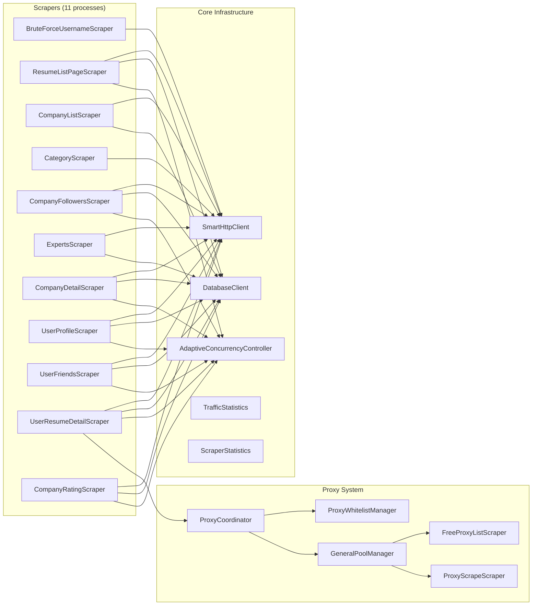

### 2. Data Pipeline

```
┌──────────┐    ┌──────────┐    ┌──────────────┐    ┌────────────┐    ┌────────────┐
│  HTTP    │    │  HTML    │    │  Data        │    │  Queue     │    │  PostgreSQL│
│  Request │--->│  Parser  │--->│  Extractor   │--->│  (Buffer)  │--->│  Database  │
└──────────┘    └──────────┘    └──────────────┘    └────────────┘    └────────────┘
                                                           │
                                                           ▼
                                                  ┌────────────────┐
                                                  │  Writer Task   │
                                                  │  (Background)  │
                                                  └────────────────┘
```

### 3. Proxy Management System

```
┌─────────────────────────────────────────────────────────────────────┐
│                        ProxyCoordinator                              │
│  Выбирает источник прокси по приоритету:                            │
│  1. ProxyWhitelistManager - проверенные рабочие прокси              │
│  2. GeneralPoolManager - общий пул из бесплатных источников         │
└─────────────────────────────────────────────────────────────────────┘
         │                    │
         ▼                    ▼
┌─────────────────┐  ┌──────────────────────┐
│ ProxyWhitelist- │  │  GeneralPoolManager  │
│ Manager         │  │                      │
│ - JSON storage  │  │  - FreeProxyListScraper │
│ - Cooldown      │  │  - ProxyScrapeScraper   │
│ - Retry limit   │  │  - GeoNode API          │
│ - daily limit   │  │  - Blacklist            │
└─────────────────┘  └──────────────────────┘
```

### 4. Data Flows

#### 4.1 UserResumeDetail Data Flow

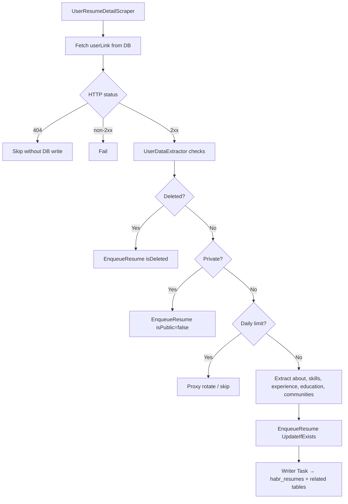

#### 4.2 University Education Data Flow

Часть пайплайна `UserResumeDetailScraper` (не отдельный скрапер):

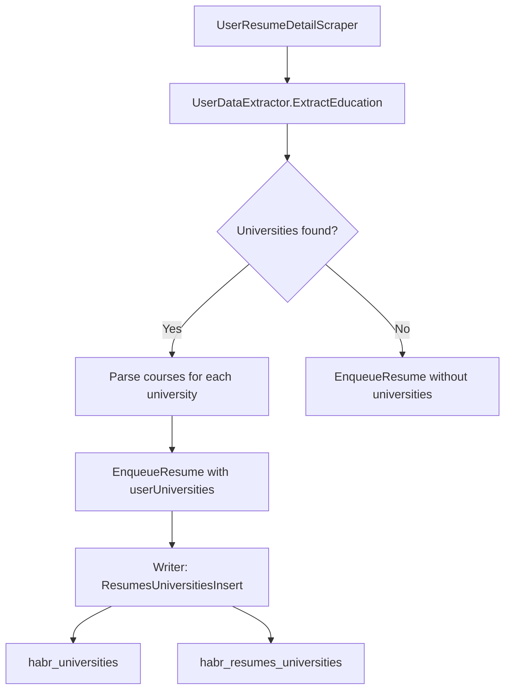

#### 4.3 UserProfile Data Flow

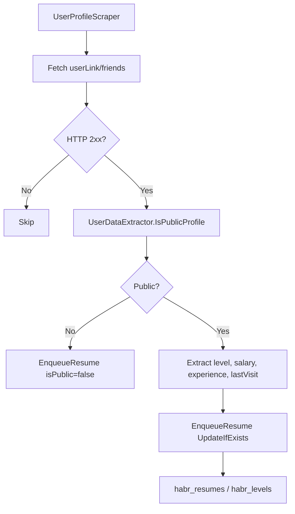

#### 4.4 UserFriends Data Flow

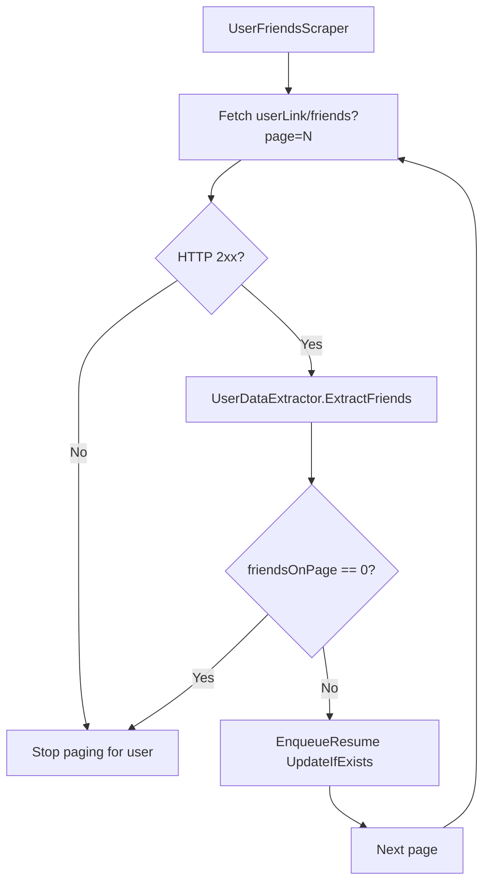

#### 4.5 ResumeListPage Data Flow

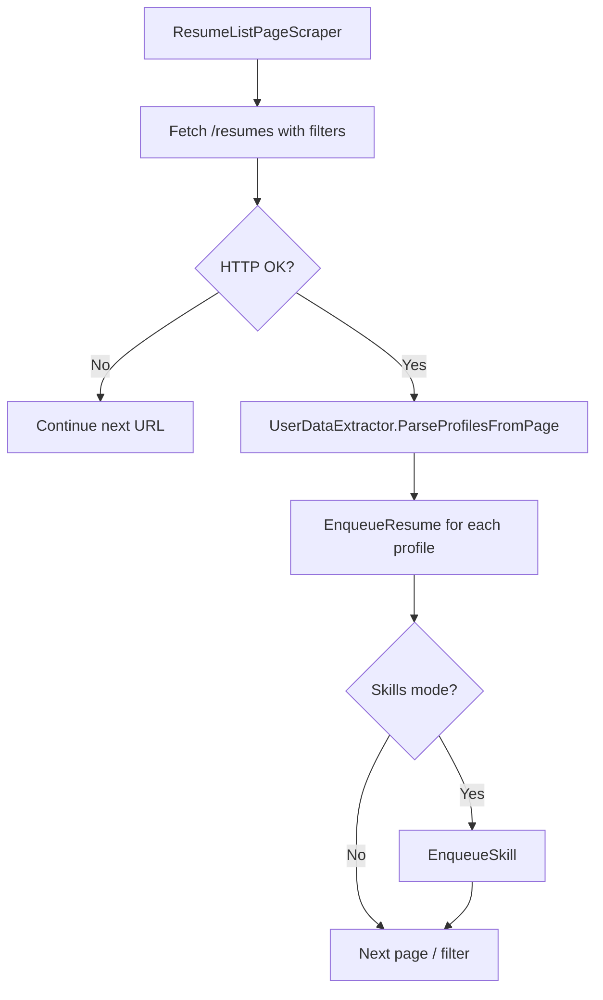

#### 4.6 BruteForceUsername Data Flow

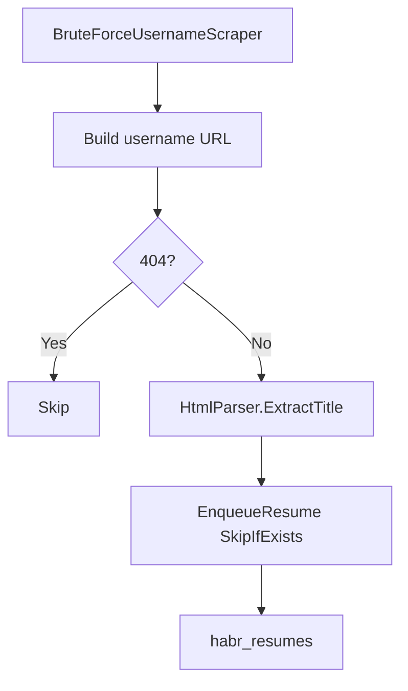

#### 4.7 Experts Data Flow

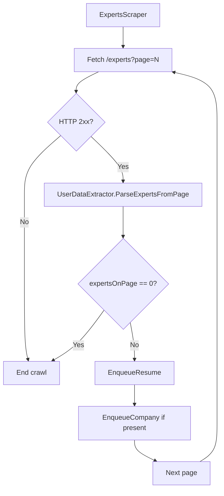

#### 4.8 CompanyList Data Flow

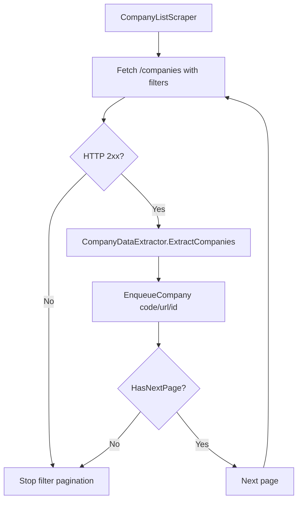

#### 4.9 Category Data Flow

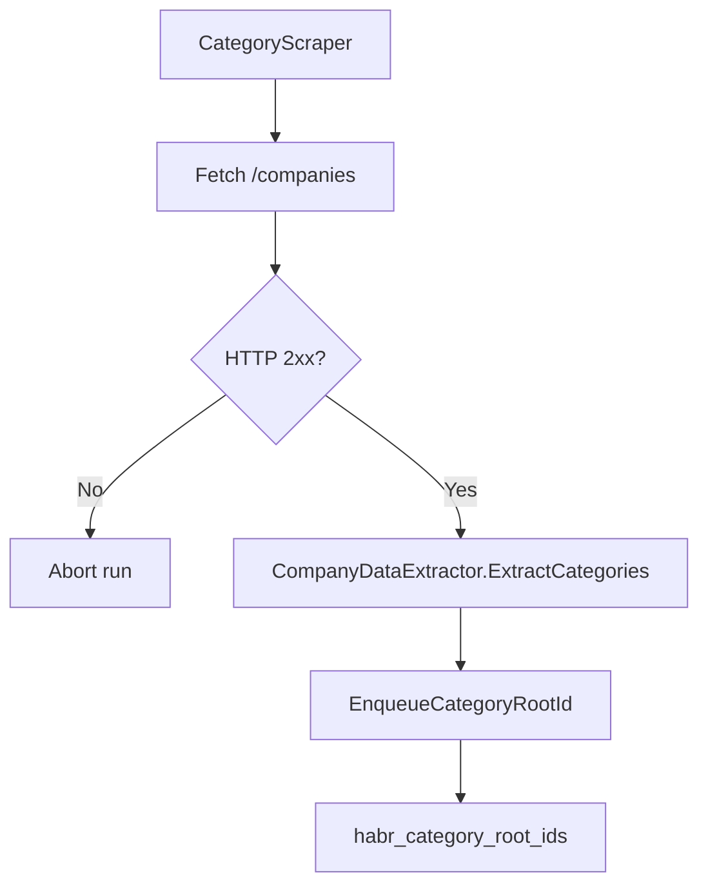

#### 4.10 CompanyDetail Data Flow

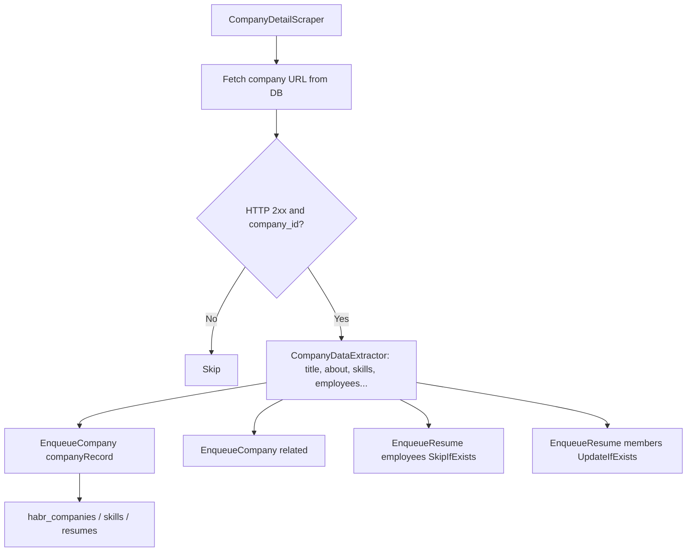

#### 4.11 CompanyFollowers Data Flow

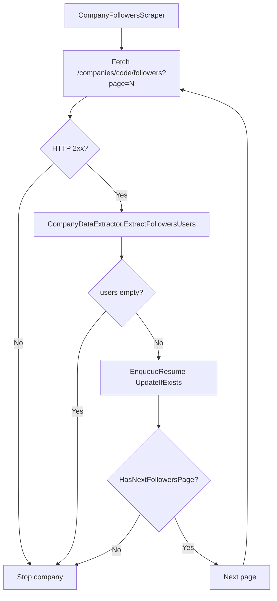

#### 4.12 CompanyRating Data Flow

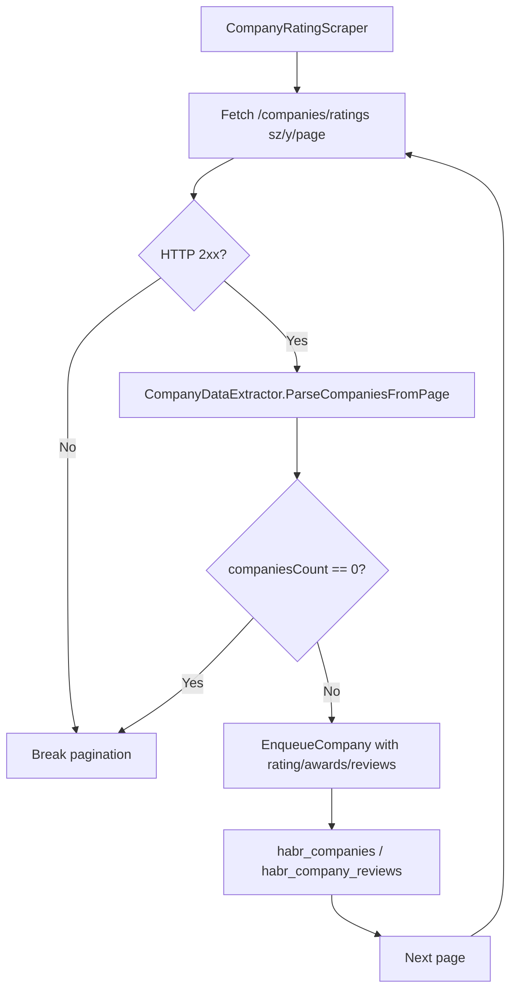

### 5. Proxy Whitelist Management

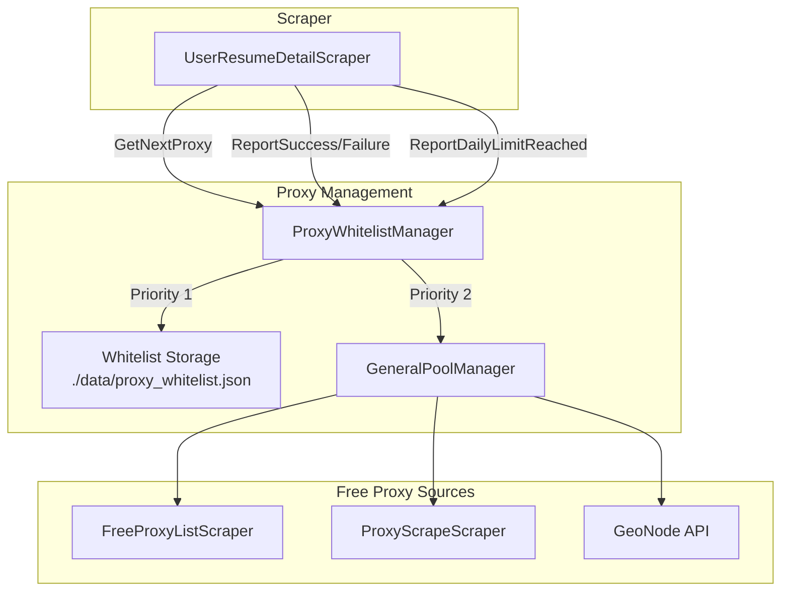

### 6. Progress Tracking System

The system uses a custom thread-safe progress tracking mechanism to report scraping execution statistics in multi-threaded environments. It ensures accurate, atomic updates of items processed and displays real-time progress.

For more details, see [Progress Tracking System](PROGRESS_TRACKING.md).

## Technical Stack

### Backend
- **.NET 9.0** - Core framework
- **C# 12** - Programming language
- **AngleSharp** - HTML DOM parsing

### Database
- **PostgreSQL 12+** - Primary data store
- **Npgsql** - .NET PostgreSQL driver

### Infrastructure
- **System.Net.Http** - HTTP client with custom retry logic
- **System.Text.Json** - JSON serialization for whitelist storage
- **System.Security.Cryptography** - MD5 hashing for review dedup

## Project Structure

```
JobBoardScraper/
  App.config                 # Runtime-конфигурация (XML)
  AppConfig.cs               # Типизированный доступ к настройкам
  Program.cs                 # Композиция скраперов и фоновых задач
  Core/
    AdaptiveConcurrencyController.cs  # Адаптивное управление параллелизмом
  Data/
    DatabaseClient.cs        # PostgreSQL-клиент с очередями записи
  Domain/
    Models/                  # DTO, модели данных, статистики
      CompanyRatingData.cs
      CommunityParticipationData.cs
      CourseData.cs
      UniversityData.cs
      UserProfileData.cs
      WhitelistProxyEntry.cs
      ...
  Parsing/
    UserDataExtractor.cs     # Извлечение данных пользователей и резюме
    CompanyDataExtractor.cs  # Извлечение данных компаний
    HtmlParser.cs            # Базовые HTML-утилиты
  Scrapers/
    BruteForceUsernameScraper.cs
    ResumeListPageScraper.cs
    CompanyListScraper.cs
    CategoryScraper.cs
    CompanyFollowersScraper.cs
    ExpertsScraper.cs
    CompanyDetailScraper.cs
    UserProfileScraper.cs
    UserFriendsScraper.cs
    UserResumeDetailScraper.cs
    CompanyRatingScraper.cs
  Infrastructure/
    Http/
      SmartHttpClient.cs     # HTTP-клиент с retry и статистикой
      HttpClientFactory.cs   # Фабрика HttpClient
      HttpClientLogger.cs    # Логирование HTTP-запросов
    Logging/
      ConsoleLogger.cs       # Логирование (Console/File/Both)
      ScraperLogger.cs       # Логирование скраперов
      ScraperProgressLogger.cs  # Прогресс-логирование
      ScraperParallelLogger.cs  # Потокобезопасное логирование
    Proxy/
      ProxyCoordinator.cs    # Координатор источников прокси
      ProxyWhitelistManager.cs  # Управление whitelist прокси
      GeneralPoolManager.cs  # Управление общим пулом
      FreeProxyListScraper.cs  # Сбор бесплатных прокси
      ProxyScrapeScraper.cs  # Сбор из ProxyScrape API
      ProxyInfo.cs           # Модель прокси
      ProxyHttpClientFactory.cs  # HTTP-клиент с прокси
      ProxyRetryExecutor.cs  # Retry для прокси
      ProxySourceHelper.cs   # Helper для источников
      ProxySourceStatistics.cs   # Статистика источников
      ProxyScraper.cs        # Базовый скрапер прокси
      ProxyScraperLauncher.cs   # Запуск прокси-скраперов
      JsonWhitelistStorage.cs   # JSON-хранилище whitelist
    Statistics/
      ScraperStatistics.cs   # Статистика скраперов
      TrafficStatistics.cs   # Статистика трафика
      DatabaseStatistics.cs  # Статистика БД
    Throttling/
      LinearThrottle.cs      # Линейный throttle
      ExponentialBackoff.cs  # Экспоненциальный backoff
    Utils/
      StringUtils.cs         # Строковые утилиты
      HashUtils.cs           # MD5 хэширование
      HtmlDebug.cs           # HTML-отладка
    Url/
      UrlManager.cs          # Управление URL
```

## Performance Characteristics

### Throughput
- **Single node**: 50-100 requests/minute (with rate limiting)
- **Proxy rotation**: 1-5 seconds per rotation

### Resource Usage
- **Memory**: 100-300MB per worker process
- **CPU**: 10-30% average utilization
- **Bandwidth**: 1-5 Mbps depending on scrape intensity

## Best Practices

### Performance Optimization
- Use appropriate rate limiting via `AdaptiveConcurrencyController`
- Implement proper caching of HTTP connections
- Optimize database queries with batch writes
- Monitor and tune proxy rotation

### Reliability
- Implement comprehensive error handling with retries
- Use `SmartHttpClient` for transient fault handling
- Monitor system health continuously via statistics
- Implement proper logging with `OutputMode`

### Security
- Keep database credentials secure in `App.config`
- Use HTTPS for all communications
- Regularly update dependencies
- Monitor for suspicious activity via traffic stats

## Future Architecture Evolution

### Planned Enhancements
- **API integration**: Use career.habr.com API (`https://career.habr.com/info/api#q1.7`) instead of HTML parsing
- **Enhanced monitoring** with Prometheus/Grafana
- **Improved proxy management** with machine learning
- **Better data processing** pipeline with streaming

This architecture provides a solid foundation for building a robust, scalable web scraping system that can handle the demands of modern data extraction while maintaining reliability and performance.