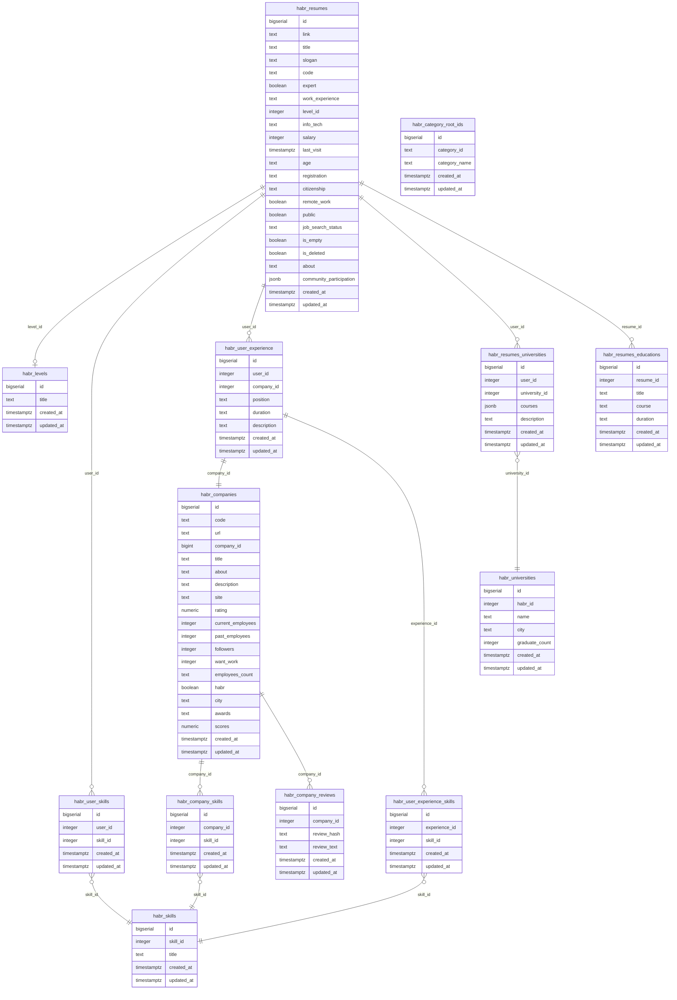

# Модель данных `JobBoardScraper` (ER-диаграмма)

Документ описывает все таблицы PostgreSQL, используемые парсером `JobBoardScraper`, и связи между ними.
ER-диаграмма оформлена в формате [Mermaid](https://mermaid.js.org/) — она рендерится в GitHub/GitLab/VS Code и поддерживается большинством Markdown-просмотрщиков.

## Сквозные обозначения

- **PK** — первичный ключ (`id`, обычно `SERIAL`/`BIGSERIAL`).
- **FK** — внешний ключ (ссылка на PK другой таблицы).
- **UQ** — уникальный ключ (`UNIQUE` constraint).
- Все таблицы имеют `created_at` / `updated_at TIMESTAMPTZ`.
- Поле `is_deleted` в `habr_resumes` используется как мягкое удаление (см. `sql/add_is_deleted_column.sql`).

## ER-диаграмма



## Ключи и индексы — отдельная таблица

GitHub Mermaid внутри `{}`-блока атрибутов принимает только `type name`. Маркеры `PK`/`FK`/`UQ` ломают парсер, поэтому они вынесены в таблицу ниже.

| Таблица | PK | UQ | FK |
| --- | --- | --- | --- |
| `habr_resumes` | `id` | `link` (ON CONFLICT `link`) | `level_id` → `habr_levels.id` |
| `habr_levels` | `id` | `title` (ON CONFLICT `title`) | — |
| `habr_companies` | `id` | `code` (ON CONFLICT `code`) | — |
| `habr_skills` | `id` | `title` (ON CONFLICT `title`) | — |
| `habr_user_skills` | `id` | — | `user_id` → `habr_resumes.id`, `skill_id` → `habr_skills.id` |
| `habr_company_skills` | `id` | — | `company_id` → `habr_companies.id`, `skill_id` → `habr_skills.id` |
| `habr_company_reviews` | `id` | `review_hash` | `company_id` → `habr_companies.id` |
| `habr_user_experience` | `id` | — | `user_id` → `habr_resumes.id`, `company_id` → `habr_companies.id` |
| `habr_user_experience_skills` | `id` | — | `experience_id` → `habr_user_experience.id`, `skill_id` → `habr_skills.id` |
| `habr_universities` | `id` | `habr_id` (ON CONFLICT `habr_id`) | — |
| `habr_resumes_universities` | `id` | — (составной `user_id`+`university_id`) | `user_id` → `habr_resumes.id`, `university_id` → `habr_universities.id` |
| `habr_resumes_educations` | `id` | — | `resume_id` → `habr_resumes.id` |
| `habr_category_root_ids` | `id` | `category_id` (ON CONFLICT `category_id`) | — |

## Пояснения к сущностям

### Основные таблицы

- **`habr_resumes`** — главная таблица. Одно резюме = один пользователь (`link` уникален).
  Содержит всю «карточку»: имя, должности, навыки (на уровне списком через `habr_user_skills`), зарплата, контакты.
  При парсинге списка резюме с career.habr.com сюда попадают только `link`, `code`, `name`, `is_expert`, `info_tech`, `level_title`, `salary`, `skills`.
  Полное наполнение (`about`, `community_participation`, `experience`, `universities`, `educations`) собирается `UserResumeDetailScraper`.

- **`habr_companies`** — компании из раздела компаний и те, что упоминаются в опыте работы (`code` уникален, приходит с career.habr.com).
- **`habr_levels`** — справочник грейдов (Junior/Middle/Senior), ссылается `habr_resumes.level_id`.
- **`habr_category_root_ids`** — справочник корневых категорий резюме.
- **`habr_skills`** — справочник навыков с уникальным `title`; `skill_id` подтягивается из URL страницы навыка на career.habr.com.

### Связующие таблицы (M:N)

- **`habr_user_skills`** — навыки конкретного пользователя (`user_id` + `skill_id`).
- **`habr_company_skills`** — навыки конкретной компании.
- **`habr_user_experience_skills`** — навыки внутри конкретной записи опыта работы.
- **`habr_resumes_universities`** — высшее образование пользователя + JSON со списком курсов `courses`.

### Зависимые таблицы

- **`habr_user_experience`** — одна запись = одно место работы пользователя; ссылается на резюме и компанию. Содержит JSON-курсы и skills через `habr_user_experience_skills`.
- **`habr_company_reviews`** — отзывы о компании с дедупликацией по хешу текста.
- **`habr_resumes_educations`** — дополнительное образование пользователя.

## Особенности дизайна

1. **`ON CONFLICT ... DO UPDATE`** — все основные таблицы используют `INSERT ... ON CONFLICT(...) DO UPDATE SET ... COALESCE(EXCLUDED.x, table.x)`. Это значит, что повторный парсинг обновляет только заполненные поля, не затирая уже имеющиеся данные значением `NULL`.

2. **JSONB для коллекций** — `community_participation`, `courses` хранятся как JSONB-массивы. Это упрощает схему (нет отдельных таблиц для Community/Course) ценой потери удобства SQL-запросов по содержимому.

3. **Мягкое удаление** — только в `habr_resumes` через `is_deleted` (см. `sql/add_is_deleted_column.sql`). Остальные таблицы жёстко удаляют записи через `DELETE`.

4. **`habr_user_skills` vs `habr_resumes.skills`** — исторически `skills` хранились и в JSON-виде внутри `habr_resumes`, и в отдельной таблице `habr_user_skills` (для быстрого поиска/фильтрации по навыкам). При парсинге списка заполняется только `skills`-поле, при детальном парсинге — обе.

## Соответствие скрейперов и таблиц

| Скрейпер | Заполняемые таблицы |
| --- | --- |
| `ResumeListPageScraper` | `habr_resumes` (только базовые поля), `habr_skills` |
| `UserResumeDetailScraper` | `habr_resumes` (полностью), `habr_user_experience`, `habr_user_experience_skills`, `habr_resumes_universities`, `habr_resumes_educations`, `habr_user_skills` |
| `UserFriendsScraper` | (friend-relations — отсутствует в БД, если есть — отдельная таблица) |
| `CompanyListScraper` | `habr_companies`, `habr_company_reviews`, `habr_company_skills` |
| `CompanyDetailScraper` | `habr_companies`, `habr_company_skills`, `habr_company_reviews` |
| `CompanyRatingScraper` | `habr_company_reviews` (через хеш) |
| `CompanyFollowersScraper` | (если используется) `habr_companies.followers` |
| `UserProfileScraper` | `habr_resumes.about`, `habr_resumes.community_participation` |
| `ExpertsScraper` | (через `habr_resumes` с фильтром `is_expert=true`) |
| `BruteForceUsernameScraper` | `habr_resumes` |

## Как рендерить

### В GitHub / GitLab
Просто откройте этот файл — они автоматически рендерят Mermaid в Preview.

### В VS Code
Установите расширение **Markdown Preview Mermaid Support** (bierner.markdown-mermaid) и откройте Preview (`Ctrl+Shift+V`).

### Локально (mermaid-cli)
```bash
npm install -g @mermaid-js/mermaid-cli
mmdc -i docs/DB_SCHEMA.md -o docs/DB_SCHEMA.svg
```

### Онлайн
Скопируйте блок `mermaid` в [mermaid.live](https://mermaid.live/).